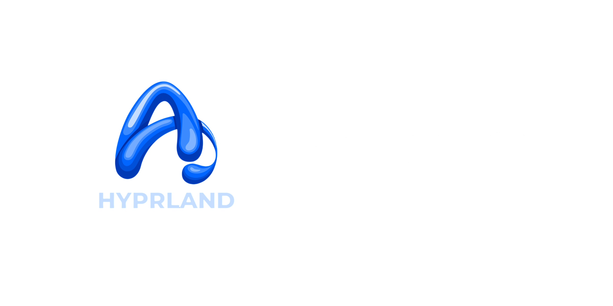
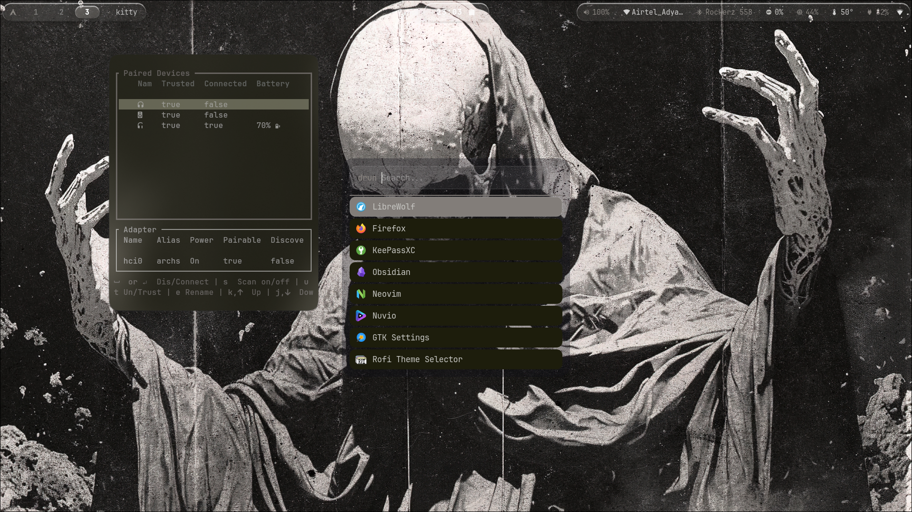
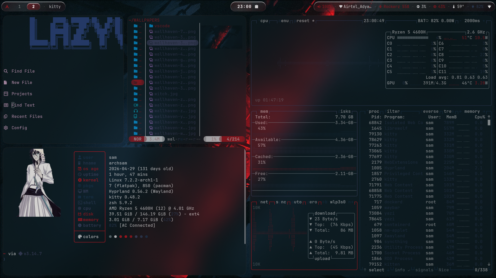
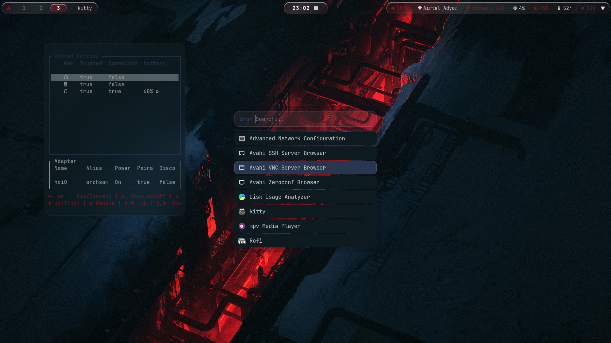
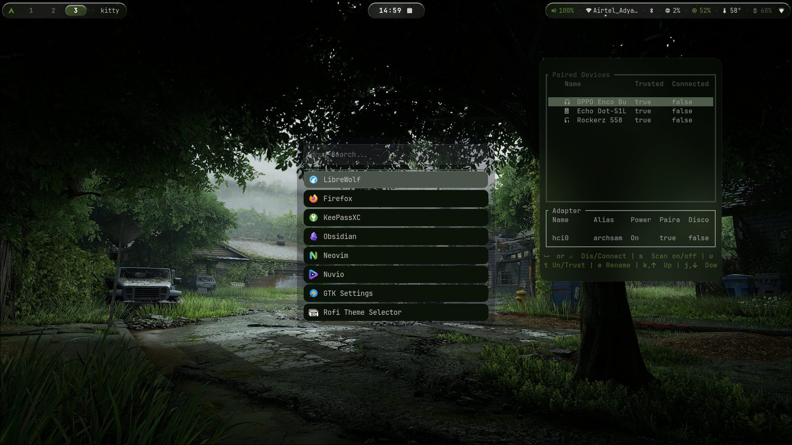
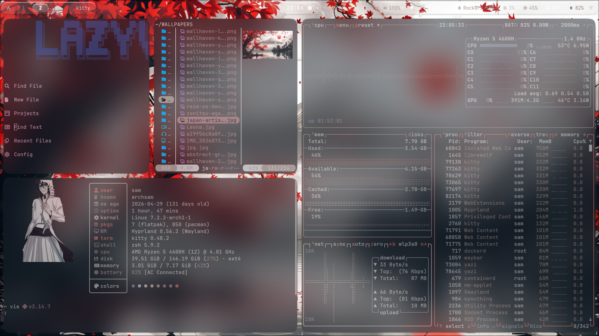

<div align="center">



# GM-Hyprland 

[](https://github.com/hyprwm/Hyprland)
[](LICENSE)
[](https://github.com/sam-k99)


[Preview](#-preview) · [Features](#-features) · [Install](#-installation) · [Keybinds](#-keybindings) 



</div>


##  Overview

**Glass** is a complete, ready-to-rice Hyprland configuration. It combines subtle glassmorphism, smooth animations, and a minimal aesthetic everything you need for a distraction-free yet beautiful workflow, straight out of the box.


##  Preview

| Desktop | Terminal |
|:---:|:---:|
|  |  |

| App Launcher | System Monitor |
|:---:|:---:|
|  |  |


##  Features

-  **Minimal & lightweight** — no bloat, only what matters
-  **Glassmorphism everywhere** — blurred bars, translucent panels
-  **Coherent color palette** across every single app
-  **Smooth animations & transitions** — buttery window movement
-  **Fully modular config** — organized, commented, easy to tweak
-  **Clean notification system**
-  **Beautiful btop skin** included
-  **One-command install script** — Arch-based ready


##  Components

| Component | Tool |
|---|---|
|  Window Manager | [Hyprland](https://github.com/hyprwm/Hyprland) |
|  Bar / Status | Waybar |
|  Wallpapers | Hyprpaper / swww |
|  Terminal | Kitty |
|  Launcher | Rofi / Wofi |
|  Notifications | Dunst |
|  System Monitor | btop (custom theme) |
|  Lock Screen | Hyprlock |
|  Logout Menu | Wlogout |


##  Requirements

- A Linux distro with `pacman` (Arch / Arch-based) — *other distros: adapt the package names*
- Hyprland & its dependencies (aquamarine, hyprlang, hyprutils, hyprcursor…)
- A compositor-capable GPU / session

<details>
<summary> <b>Full dependency list (click to expand)</b></summary>

```bash
hyprland hyprpaper hyprlock hypridle
waybar kitty rofi wofi wlogout
dunst btop swappy grim slurp
polkit-gnome xdg-desktop-portal-hyprland
qt5-wayland qt6-wayland
```

</details>


##  Installation

> Back up your existing configs first!

```bash
mv ~/.config ~/.config.bak   # backup

# Clone the repo
git clone https://github.com/sam-k99/Glass-minimal-hyprland.git
cd Glass-minimal-hyprland

# Copy configs into place
cp -r ./* ~/.config/
```

Then **log out and select Hyprland** from your session manager. Done. 

<details>
<summary> <b>Automated install (recommended)</b></summary>

```bash
chmod +x install.sh
./install.sh
```

The script installs all dependencies and copies the configs automatically.

</details>


##  Keybindings

| Keys | Action |
|---|---|
| `Super + q` | Open terminal |
| `Super + c` | Close window |
| `Super + space` | App launcher |
| `Super + m` | Exit Hyprland |
| `Super + 1-9` | Switch workspace |
| `Super + Shift + 1-9` | Move window to workspace |
| `Super + Arrow / Mouse` | Move / resize windows |
| `Super + B` | Open browser |
| `Super + F` | File manager |
| `Super + V` | Toggle floating |
| `Print` | Screenshot |
| `Super + L` | Lock screen |

>  Full list lives in `~/.config/hypr/keybinds.conf` -remap freely.


##  Repository Structure

```
Glass-minimal-hyprland/
├── assets/          #  Screenshots & wallpapers
├── btop/            #  btop system monitor theme
├── hypr/            #  Hyprland core configuration
├── waybar/          #  Status bar
├── kitty/           #  Terminal
├── rofi/            #  App launcher
├── dunst/           #  Notifications
├── hyprlock/        #  Lock screen
├── LICENSE
└── README.md
```


##  Customization

Everything is modular and commented:

- **Colors & theme** → tweak the palette at the top of each config
- **Keybinds** → `hypr/keybinds.conf`
- **Animations** → `hypr/hyprland.conf`
- **Bar modules** → `waybar/config.jsonc`


##  Contributing

Found a bug or have an idea to make **Glass** even cleaner?

1. Fork the repo
2. Create your branch (`git checkout -b feature/amazing-idea`)
3. Commit changes (`git commit -m ' add amazing idea'`)
4. Push & open a Pull Request


##  Show Some Love

If this setup made your desktop prettier, consider dropping a **star** it helps others find it too.

<div align="center">

Thanks for stopping by 


